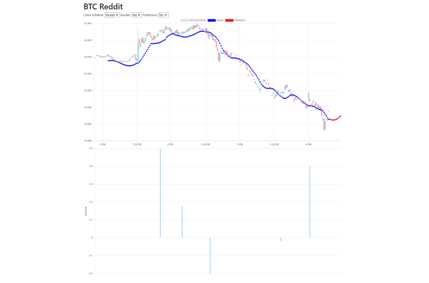

# Big-data-crypto-sentiment-analysis
A web-based application utilizes big data technology for sentiment analysis on the cryptocurrency market

`python == 3.11` 

This project aims to fill this research gap by focusing on the development of a robust data pipeline that integrates big data technologies for real-time data collection, processing, and analysis. The data pipeline is central to the project's design, enabling seamless data flow from collection through APIs (e.g., Reddit and Binance) to processing with streaming tools like Apache Kafka and Spark, and finally storing and visualizing the data in a web-based application. 

## system design

## Website
